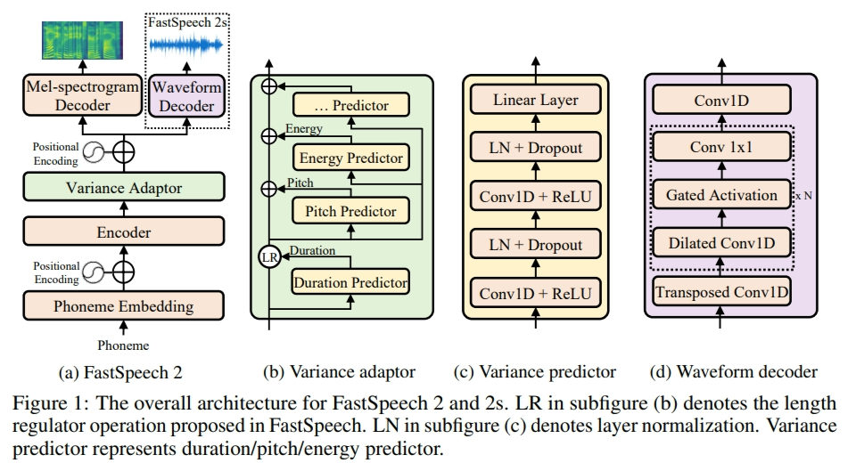
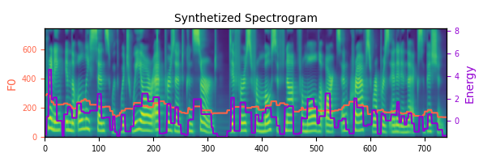

# FastSpeech 2 - PyTorch Implementation

This is a PyTorch implementation of Microsoft's text-to-speech system [**FastSpeech 2: Fast and High-Quality End-to-End Text to Speech**](https://arxiv.org/abs/2006.04558). 
This project is based on [ming's implementation](https://github.com/ming024/FastSpeech2) of FastSpeech2.

There are several versions of FastSpeech 2.
This implementation is more similar to [version 2](https://arxiv.org/abs/2006.04558), which uses pitch spectrograms extracted by continuous wavelet transform as oppose to directly using F0 values as the pitch features as in previous paper[version 1](https://arxiv.org/abs/2006.04558v1).



# Changes in the implementation
- Support for **Parallel WaveGAN** vocoder (as in the FastSpeech 2 paper). Use `config/LJSpeech_paper/` and download the PWG checkpoint from [ParallelWaveGAN](https://github.com/kan-bayashi/ParallelWaveGAN) (LJSpeech v1) into `pwg/checkpoint-400000steps.pkl`.
- modified pich modeling to utilize pitch spectrograms extracted by continuous wavelet transform as oppose to directly using F0 values.

# Audio Samples
Audio samples generated by this implementation can be found [here](https://github.com/rotemoran/DLA_fastspeech2/tree/main/results) along samples provided by the original fastspeech2 paper (GT, fastspeech and fastspeech2). 

# Quickstart

## Dependencies
You can install the Python dependencies with
```
pip3 install -r requirements.txt
```

## Inference

You have to download the [pretrained models](https://drive.google.com/drive/folders/1DOhZGlTLMbbAAFZmZGDdc77kz1PloS7F?usp=sharing) and put them in ``output/ckpt/LJSpeech/``.

For English single-speaker TTS, run
```
python3 synthesize.py --text "YOUR_DESIRED_TEXT" --restore_step 900000 --mode single -p config/LJSpeech_paper/preprocess.yaml -m config/LJSpeech_paper/model.yaml -t config/LJSpeech_paper/train.yaml
```

The generated utterances will be put in ``output/result/``.

Here is an example of synthesized mel-spectrogram of the sentence "Printing, in the only sense with which we are at present concerned, differs from most if not from all the arts and crafts represented in the Exhibition", with the English single-speaker TTS model.  


# Training

## Datasets

The dataset used is

- [LJSpeech](https://keithito.com/LJ-Speech-Dataset/): a single-speaker English dataset consists of 13100 short audio clips of a female speaker 

## Preprocessing
 
First, run 
```
python3 prepare_align.py config/LJSpeech_paper/preprocess.yaml
```
for some preparations.

As described in the paper, [Montreal Forced Aligner](https://montreal-forced-aligner.readthedocs.io/en/latest/) (MFA) is used to obtain the alignments between the utterances and the phoneme sequences.
Alignments of the supported datasets are provided [here](https://drive.google.com/drive/folders/1DBRkALpPd6FL9gjHMmMEdHODmkgNIIK4?usp=sharing).
You have to unzip the files in ``preprocessed_data/LJSpeech/TextGrid/``.

After that, run the preprocessing script by
```
python3 preprocess.py config/LJSpeech_paper/preprocess.yaml
```

Alternately, you can align the corpus by yourself. 
Download the official MFA package and run
```
./montreal-forced-aligner/bin/mfa_align raw_data/LJSpeech/ lexicon/librispeech-lexicon.txt english preprocessed_data/LJSpeech_paper
```

to align the corpus and then run the preprocessing script.
```
python3 preprocess.py config/LJSpeech_paper/preprocess.yaml
```

## Training

Train your model with
```
python3 train.py -p config/LJSpeech_paper/preprocess.yaml -m config/LJSpeech_paper/model.yaml -t config/LJSpeech_paper/train.yaml
```

The model takes less than 10k steps (less than 1 hour on my GTX1080Ti GPU) of training to generate audio samples with acceptable quality, which is much more efficient than the autoregressive models such as Tacotron2.

## Evalution

the paper evaluated the model performance via mean opinion score (MOS) evaluation. therefore the repo doesnt contain automated evaluation code.


# References
- [FastSpeech2 implementation by ming](https://github.com/ming024/FastSpeech2)
- [FastSpeech 2: Fast and High-Quality End-to-End Text to Speech](https://arxiv.org/abs/2006.04558), Y. Ren, *et al*.
- [xcmyz's FastSpeech implementation](https://github.com/xcmyz/FastSpeech)
- [TensorSpeech's FastSpeech 2 implementation](https://github.com/TensorSpeech/TensorflowTTS)
- [rishikksh20's FastSpeech 2 implementation](https://github.com/rishikksh20/FastSpeech2)
